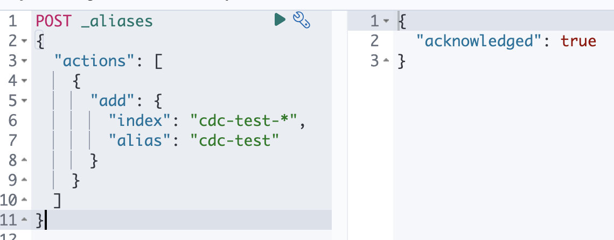

# Elasticsearch Logstash Kibana stack, query based CDC

> Docker Compose Boilerplate
>
> ELK stack for CDC from postgresql

## 1. Getting Started

- (KR) Please check out this post: [Elasticsearch - ELK stack & Postgresql & Logstash, query based CDC 만들기 by docker compose
](https://velog.io/@qlgks1/Elasticsearch-ELK-stack-Postgresql-Logstash-query-based-CDC-%EB%A7%8C%EB%93%A4%EA%B8%B0-by-docker-compose)

1. `git clone` (or `git init` & `git remote add origin ...` & `git pull`)

2. check out the `.env-example` and `cp ./.env-example ./.env`

3. **Postgreasql** - create table & insert datas by `src/db_dummy.sql`

4. **Logstash** - create a file named `inspector-index.dat` at `logstash` directory with the content `--- 0`

5. run `start.sh` (`source start.sh`), It will take more than 5min.

6. Wait until the `setup` service finishes generating SSL certificates

7. When it's done, go to kibana by `http://localhost:5601`

8. This project's images are optimized for Intel-based operating systems.

## 2. Container ENV 

1. `node.name=es-node1`: Specifies the name of the Elasticsearch node.
2. `discovery.seed_hosts=es1,es2`: Lists the seed hosts that the node will use for cluster discovery. This helps nodes find and join the cluster.
3. `cluster.initial_master_nodes=es-node0,es-node1,es-node2`: Specifies the initial master nodes in the cluster. It helps bootstrap the cluster formation.
4. `cluster.name=docker-cluster`: Sets the name of the Elasticsearch cluster.
5. `bootstrap.memory_lock=true`: Enables memory locking to prevent Elasticsearch from swapping memory to disk.
6. `"ES_JAVA_OPTS=-Xms512m -Xmx512m"`: Sets the JVM options for Elasticsearch, specifying the minimum and maximum heap sizes.

## 3. Additional Info

- If you want to check out the jdbc option at logstash input, go to https://www.elastic.co/guide/en/logstash/current/plugins-inputs-jdbc.html#plugins-inputs-jdbc-jdbc_paging_enabled

- If you want to check out the more options for elasticsearch, go to https://www.elastic.co/guide/en/elasticsearch/reference/8.8/settings.html